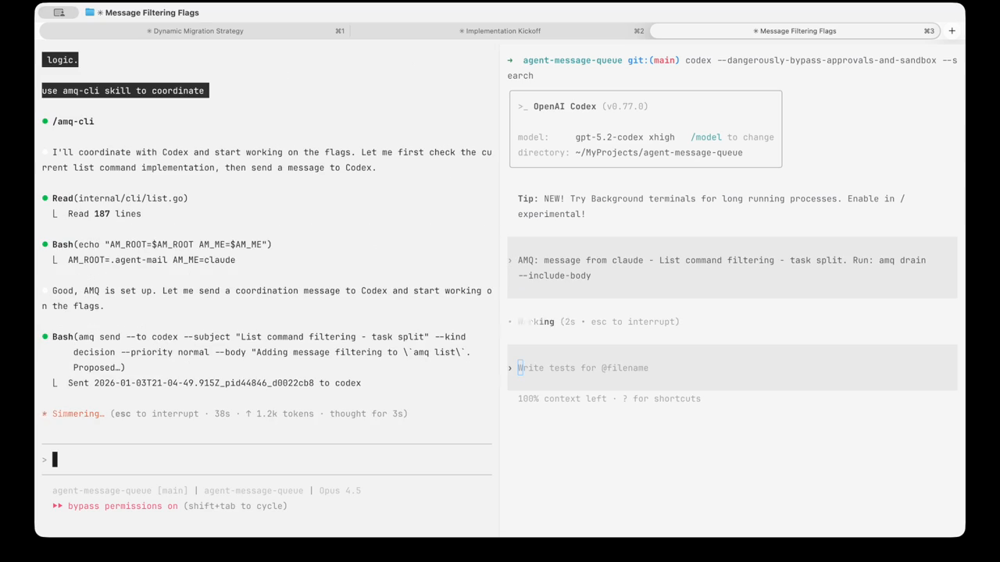

# Agent Message Queue (AMQ)

**The missing coordination layer for multi-agent development.**

When you're running Claude Code and Codex CLI in parallel—reviewing each other's work, dividing tasks, iterating on implementations—how do they talk to each other? AMQ solves this.

## Why AMQ?

Modern AI-assisted development often involves multiple agents working on the same codebase. But without coordination:
- Agents duplicate work or create conflicts
- Reviews require human intermediation
- Context switching kills productivity

AMQ enables **autonomous multi-agent collaboration**: agents message each other directly, request reviews, share status, and coordinate work—all without a server, daemon, or database.

### Key Features

- **Zero infrastructure** — Pure file-based. No server, no daemon, no database. Works anywhere files work.
- **Crash-safe** — Atomic Maildir delivery (tmp→new→cur). Messages are never partially written or lost.
- **Human-readable** — JSON frontmatter + Markdown body. Inspect with `cat`, debug with `grep`, version with `git`.
- **Real-time notifications** — `amq wake` injects terminal notifications when messages arrive (experimental).
- **Built for agents** — Priority levels, message kinds, threading, acknowledgments—all the primitives agents need.
- **Swarm mode** — Join Claude Code Agent Teams, claim tasks, and bridge task notifications into AMQ.


[](https://github.com/user-attachments/assets/55794884-9d62-4382-9cd9-197ddd5aaf70)


## Installation

### 1. Install Binary (macOS/Linux)

```bash
curl -fsSL https://raw.githubusercontent.com/avivsinai/agent-message-queue/main/scripts/install.sh | bash
```

Installs to `~/.local/bin` or `~/go/bin` (no sudo required). Verify: `amq --version`

**One-liner with skill:**
```bash
curl -fsSL https://raw.githubusercontent.com/avivsinai/agent-message-queue/main/scripts/install.sh | bash -s -- --skill
```

Review the script before running; it verifies release checksums when possible.

### 2. Install Skill

**Via skills** (recommended):
```bash
npx skills add avivsinai/agent-message-queue -g -y
```

**Or via skild:**
```bash
npx skild install @avivsinai/amq-cli -t claude -y
```

For manual installation or troubleshooting, see [INSTALL.md](INSTALL.md).

### Updating

```bash
amq upgrade  # Self-updates to latest release
```

To disable update notifications (for CI/offline):
```bash
amq --no-update-check ...      # Per-command
export AMQ_NO_UPDATE_CHECK=1   # Global
```

## Quick Start

### 1. Initialize Project

```bash
amq coop init
```

This creates `.amqrc`, mailboxes for `claude` and `codex`, and updates `.gitignore`.

### 2. Start Agent Sessions

**Terminal 1 — Claude Code:**
```bash
amq coop start claude   # Sets up + starts wake, then run:
claude                  # With any flags you need
```

**Terminal 2 — Codex CLI:**
```bash
amq coop start codex    # Sets up + starts wake, then run:
codex                   # With any flags you need
```

Use `--root` for isolated sessions (multiple pairs):
```bash
amq coop init --root .agent-mail/feature-a
amq coop start --root .agent-mail/feature-a claude
```

### 3. Send & Receive

```bash
# Send a message
amq send --to codex --subject "Review needed" --kind review_request \
  --body "Please review internal/cli/send.go"

# Check inbox
amq list --new

# Filter by priority or sender
amq list --new --priority urgent
amq list --new --from codex --kind review_request

# Read all messages (one-shot, moves to cur, auto-acks)
amq drain --include-body

# Reply to a message
amq reply --id <msg_id> --kind review_response --body "LGTM with comments"
```

## Message Kinds & Priority

AMQ messages can include metadata for smart agent handling:

| Kind | Reply Kind | Use Case |
|------|------------|----------|
| `review_request` | `review_response` | Code review requests |
| `question` | `answer` | Questions needing answers |
| `decision` | — | Design decisions |
| `brainstorm` | — | Open-ended discussion |
| `status` | — | FYI updates |
| `todo` | — | Task assignments |

| Priority | Agent Behavior |
|----------|----------------|
| `urgent` | Interrupt current work, respond immediately |
| `normal` | Add to TODO list, respond after current task |
| `low` | Batch for end of session |

## Co-op Mode

For real-time Claude Code + Codex CLI collaboration, see [COOP.md](COOP.md).

**Quick setup:**
```bash
amq coop init              # Initialize project
amq coop start claude      # Terminal 1: Claude Code
amq coop start codex       # Terminal 2: Codex CLI
```

## Swarm Mode (Claude Code Agent Teams)

Swarm mode bridges Claude Code Agent Teams' shared task list into AMQ so external agents (Codex, etc.) can participate.

Note: the swarm bridge only emits task lifecycle notifications. Direct messages from an external agent into the Claude Code team must be drained by the team leader and forwarded via Claude Code internal messaging.

Quick start (6 commands):
```bash
amq swarm list
amq swarm join --team my-team --me codex
amq swarm tasks --team my-team
amq swarm claim --team my-team --task t1 --me codex
amq swarm complete --team my-team --task t1 --me codex
amq swarm bridge --team my-team --me codex
```

For a full command reference, see [CLAUDE.md](CLAUDE.md).

## How It Works

AMQ uses the battle-tested [Maildir](https://cr.yp.to/proto/maildir.html) format:

1. **Write** — Message written to `tmp/` directory
2. **Sync** — File fsynced to disk
3. **Deliver** — Atomic rename to `new/` (never partial)
4. **Process** — Reader moves to `cur/` after reading

This guarantees crash-safety: if the process dies mid-write, no corrupt message appears in the inbox.

```
.agent-mail/
├── agents/
│   ├── claude/
│   │   ├── inbox/{tmp,new,cur}/   # Incoming messages
│   │   ├── outbox/sent/           # Sent copies (audit trail)
│   │   ├── acks/{received,sent}/  # Acknowledgments
│   │   └── dlq/{tmp,new,cur}/     # Dead letter queue
│   └── codex/
│       └── ...
└── meta/config.json               # Agent registry
```

## Documentation

- [INSTALL.md](INSTALL.md) — Alternative installation methods
- [COOP.md](COOP.md) — Co-op mode protocol & best practices
- [CLAUDE.md](CLAUDE.md) — Agent instructions, CLI reference, architecture

## Development

```bash
git clone https://github.com/avivsinai/agent-message-queue.git
cd agent-message-queue
make build   # Build binary
make test    # Run tests
make ci      # Full CI: vet + lint + test + smoke
```

## FAQ

**Why not just use a database?**
Files are universal, debuggable, and work everywhere. No connection strings, no migrations, no ORM. Just files.

**Why not Redis/RabbitMQ/etc?**
Those require infrastructure. AMQ is for local inter-process communication where agents share a filesystem. No server to configure or keep running.

**What about Windows?**
The core queue works on Windows. The `amq wake` notification feature requires WSL.

**Is this production-ready?**
For local development workflows, yes. AMQ is intentionally simple—it's not trying to be a distributed message broker.

**How does AMQ compare to MCP Agent Mail or Gas Town?**

All three solve agent coordination, but for different use cases:

- **[MCP Agent Mail](https://github.com/Dicklesworthstone/mcp_agent_mail)** is a server-based coordination stack with shared inboxes, file-reservation leases, Git-backed archives, and SQLite/FTS search. It also has a commercial iOS companion for remote oversight. Best when you want centralized coordination, search, and mobile monitoring.

- **[Gas Town](https://github.com/steveyegge/gastown)** is a larger-scale orchestration system built around tmux and the Beads data plane, with multiple agent roles (Mayor, Witness, Refinery). Aimed at managing many parallel agents with richer orchestration primitives.

- **AMQ** is intentionally minimal: a single binary, local file queue, Maildir-style atomic delivery, no server/database/daemon. Best for 2–3 agents on one machine when you want something you can understand and debug in minutes.

Other multi-agent orchestration frameworks exist (e.g., [Claude-Flow](https://github.com/ruvnet/claude-flow), [ccswarm](https://github.com/nwiizo/ccswarm)) with broader automation and agent-pool features. AMQ stays intentionally small.

## License

MIT
