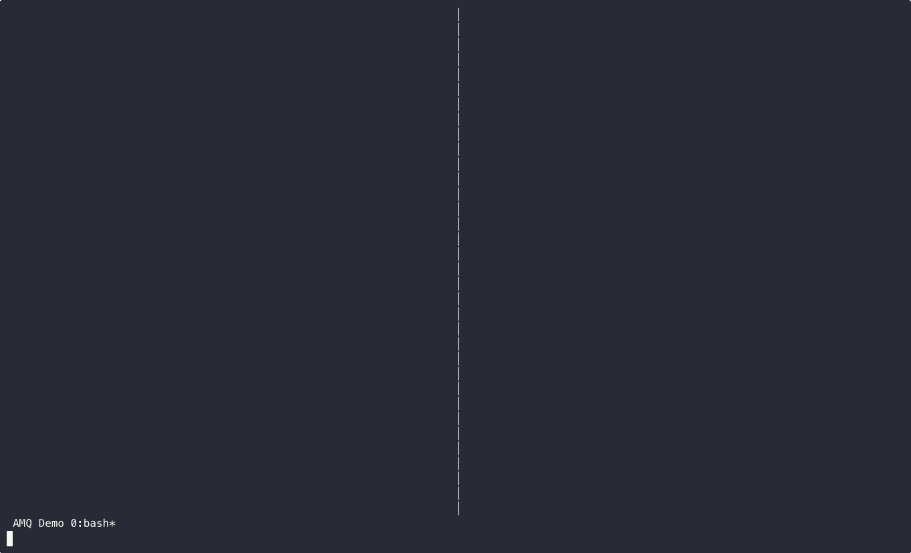

# Agent Message Queue (AMQ)

**The missing coordination layer for multi-agent development.**

When you're running Claude Code and Codex CLI in parallel—reviewing each other's work, dividing tasks, iterating on implementations—how do they talk to each other? AMQ solves this.

## Why AMQ?

Modern AI-assisted development often involves multiple agents working on the same codebase. But without coordination:
- Agents duplicate work or create conflicts
- Reviews require human intermediation
- Context switching kills productivity

AMQ enables **autonomous multi-agent collaboration**: agents message each other directly, request reviews, share status, and coordinate work—all without a server, daemon, or database.

### Key Features

- **Zero infrastructure** — Pure file-based. No server, no daemon, no database. Works anywhere files work.
- **Crash-safe** — Atomic Maildir delivery (tmp→new→cur). Messages are never partially written or lost.
- **Human-readable** — JSON frontmatter + Markdown body. Inspect with `cat`, debug with `grep`, version with `git`.
- **Real-time notifications** — `amq wake` injects terminal notifications when messages arrive (experimental).
- **Built for agents** — Priority levels, message kinds, threading, acknowledgments—all the primitives agents need.
- **Swarm mode** — Join Claude Code Agent Teams, claim tasks, and bridge task notifications into AMQ.



## Installation

### 1. Install Binary

**macOS (Homebrew):**
```bash
brew install avivsinai/tap/amq
```

**macOS/Linux (script):**
```bash
curl -fsSL https://raw.githubusercontent.com/avivsinai/agent-message-queue/main/scripts/install.sh | bash
```

Installs to `~/.local/bin` or `~/go/bin` (no sudo required). Verify: `amq --version`

**One-liner with skill:**
```bash
curl -fsSL https://raw.githubusercontent.com/avivsinai/agent-message-queue/main/scripts/install.sh | bash -s -- --skill
```

Review the script before running; it verifies release checksums when possible.

### 2. Install Skill

**Via skills** (recommended):
```bash
npx skills add avivsinai/agent-message-queue -g -y
```

**Or via skild:**
```bash
npx skild install @avivsinai/amq-cli -t claude -y
```

For manual installation or troubleshooting, see [INSTALL.md](INSTALL.md).

### Updating

```bash
amq upgrade
```

## Quick Start

### 1. Initialize Project

```bash
amq coop init
```

This creates `.amqrc`, mailboxes for `claude` and `codex`, and updates `.gitignore`.

### 2. Start Agent Sessions

**Terminal 1 — Claude Code:**
```bash
amq coop exec claude -- --dangerously-skip-permissions
```

**Terminal 2 — Codex CLI:**
```bash
amq coop exec codex -- --dangerously-bypass-approvals-and-sandbox
```

`coop exec` auto-initializes if needed, sets `AM_ROOT`/`AM_ME`, starts wake, and execs into the agent.

Use `--root` for isolated sessions (multiple pairs):
```bash
amq coop exec --root .agent-mail/feature-a claude
```

### 3. Send & Receive

```bash
# Send a message
amq send --to codex --subject "Review needed" --kind review_request \
  --body "Please review internal/cli/send.go"

# Check inbox
amq list --new

# Filter by priority or sender
amq list --new --priority urgent
amq list --new --from codex --kind review_request

# Read all messages (one-shot, moves to cur, auto-acks)
amq drain --include-body

# Reply to a message
amq reply --id <msg_id> --kind review_response --body "LGTM with comments"
```

## Message Kinds & Priority

AMQ messages support kinds (`review_request`, `question`, `todo`, etc.) and priority levels (`urgent`, `normal`, `low`). See [COOP.md](COOP.md) for the full protocol.

## Co-op Mode

For real-time Claude Code + Codex CLI collaboration patterns, roles, and phased workflows, see [COOP.md](COOP.md).

## Swarm Mode (Claude Code Agent Teams)

External agents (Codex, etc.) can join Claude Code Agent Teams via `amq swarm join`, claim tasks, and receive notifications through `amq swarm bridge`. Note: the bridge delivers task notifications only; direct messages require relay through the team leader.

For the full command reference, see [CLAUDE.md](CLAUDE.md).

## How It Works

AMQ uses the battle-tested [Maildir](https://cr.yp.to/proto/maildir.html) format:

1. **Write** — Message written to `tmp/` directory
2. **Sync** — File fsynced to disk
3. **Deliver** — Atomic rename to `new/` (never partial)
4. **Process** — Reader moves to `cur/` after reading

This guarantees crash-safety: if the process dies mid-write, no corrupt message appears in the inbox. See [CLAUDE.md](CLAUDE.md) for the full directory layout.

## Documentation

- [INSTALL.md](INSTALL.md) — Alternative installation methods
- [COOP.md](COOP.md) — Co-op mode protocol & best practices
- [CLAUDE.md](CLAUDE.md) — Agent instructions, CLI reference, architecture

## Development

```bash
git clone https://github.com/avivsinai/agent-message-queue.git
cd agent-message-queue
make build   # Build binary
make test    # Run tests
make ci      # Full CI: vet + lint + test + smoke
```

## FAQ

**Why not just use a database?**
Files are universal, debuggable, and work everywhere. No connection strings, no migrations, no ORM. Just files.

**Why not Redis/RabbitMQ/etc?**
Those require infrastructure. AMQ is for local inter-process communication where agents share a filesystem. No server to configure or keep running.

**What about Windows?**
The core queue works on Windows. The `amq wake` notification feature requires WSL.

**Is this production-ready?**
For local development workflows, yes. AMQ is intentionally simple—it's not trying to be a distributed message broker.

**How does AMQ compare to other multi-agent tools?**
Tools like [MCP Agent Mail](https://github.com/Dicklesworthstone/mcp_agent_mail) (server-based coordination + SQLite), [Gas Town](https://github.com/steveyegge/gastown) (tmux-based orchestration), and others offer richer features. AMQ is intentionally minimal: single binary, no server, Maildir delivery. Best for 2-3 agents on one machine.

## License

MIT
